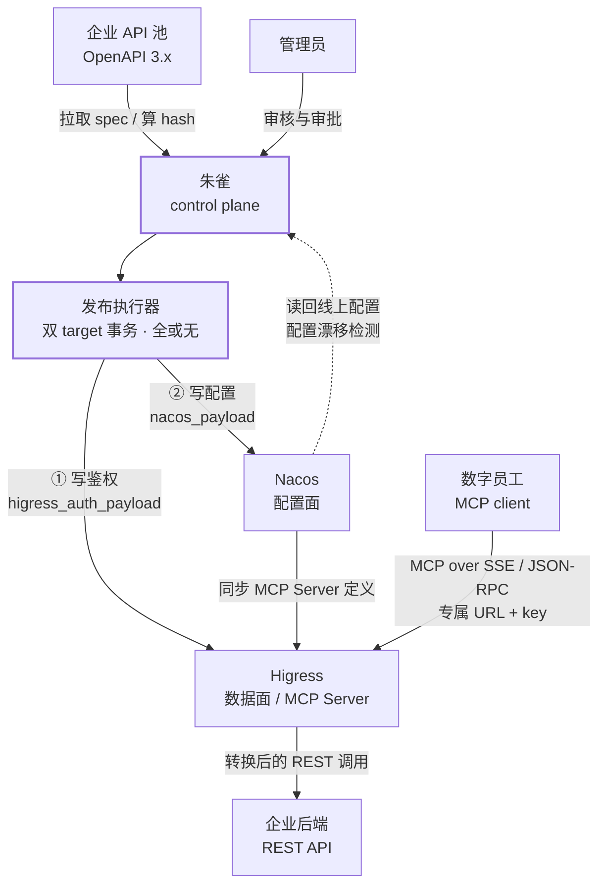
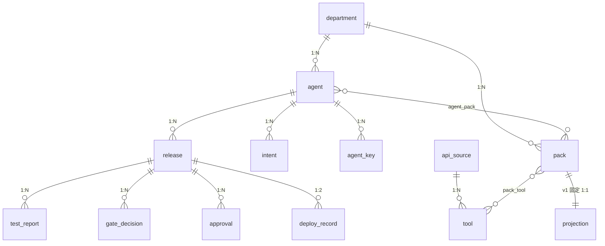
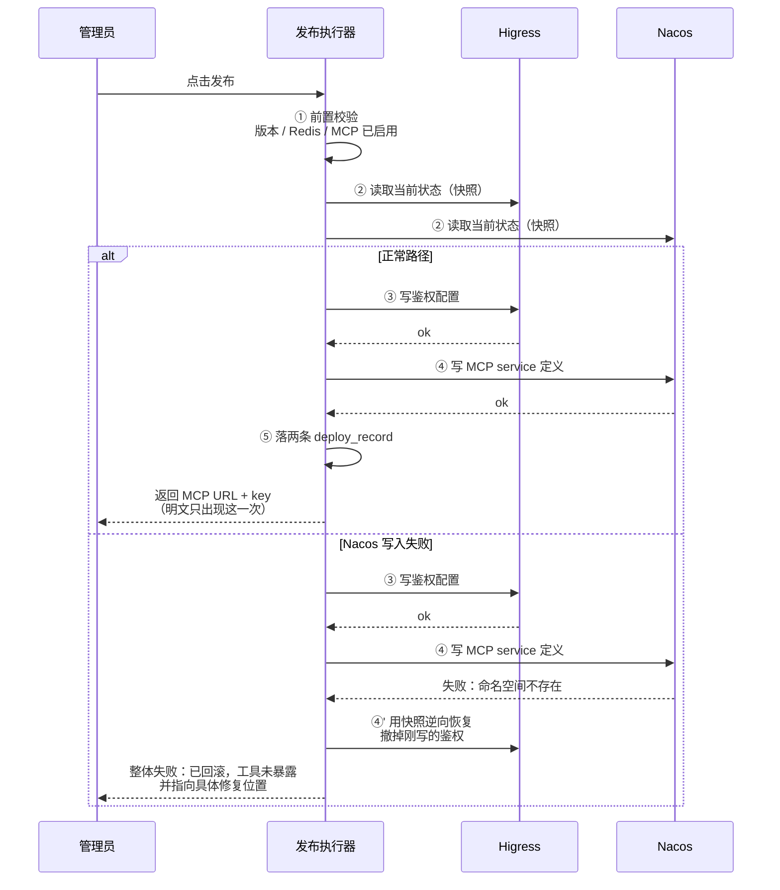

# 朱雀 · 能力发布控制面

朱雀把企业的 REST API 池，编译成经过测试、审批、版本化、可回滚的**数字员工能力**，以声明式配置发布到 Nacos，由 Higress 网关执行。

> [!abstract] 一句话
> 它不回答「怎么把 API 变成 MCP」——那是工具链的事。
> 它回答的是：**凭什么让这个数字员工，带着这些工具上线。**

---

## 一、为什么需要一个控制面

把 OpenAPI 转成 MCP 工具，已经有现成方案。真正卡住企业的不是转换，而是转换之后**没人敢按下发布**。三个具体的失效场景：

### 1. 300 个 endpoint，人审不过来

一个中型企业的 API 池轻松上百。让管理员逐个判断「这个数字员工该不该有这个工具」，要么审不完，要么全批——两种结果一样危险。

> [!danger] 失效方式：全量放行

### 2. 工具看着合理，组合起来是死的

包里有 `get_order_detail(order_id)` 和 `create_refund(order_id)`，但用户打电话只报手机号——**没有任何工具能拿到 order_id**。

上线即死，而且不报错：Agent 会瞎编 ID，或反复追问用户一个他不可能知道的内部标识。

> [!danger] 失效方式：静默失效

### 3. 出了事，说不清是谁批的

数字员工误退了一笔款。当时用的是哪版工具定义、谁批准的、基于什么测试结果、上游 API 那天改没改过——没有一个系统能同时回答这四个问题。

> [!danger] 失效方式：无法复盘

---

## 二、三方分工：朱雀不在调用链上

这是整个架构最关键的一条边界。朱雀是**纯控制面**——只生产静态 JSON 配置和证据记录，不收发任何 MCP 协议消息。数字员工运行时，朱雀就算整个宕掉，线上服务也不受影响。

| | 朱雀 | Nacos | Higress |
|---|---|---|---|
| **角色** | 控制面 | 配置面 | 数据面 |
| **职责** | 意图拆解、工具匹配、闭包检查、分层测试、门禁判定、审批与回滚编排 | 存 MCP service 定义（tools / inputSchema / 参数映射）、版本历史、灰度、密钥托管 | 真正的 MCP Server：终结 SSE / JSON-RPC、MCP↔REST 转换、入口鉴权、限流、日志 |
| **持有** | 配置 JSON + 证据包 | 配置的真实状态 | 所有线上流量 |
| **版本要求** | — | ≥ 3.0.1（走 Admin API） | 需支持同步 Nacos 原生 MCP Server，依赖 Redis |

> [!warning] 明确不实现
> MCP 协议服务端、API 网关、服务注册表、配置版本存储、开发者门户 / 市场。
> 这些由 Higress / Nacos 承担，做了就是越界。

---

## 三、谁连谁，数据往哪个方向走

> [!important] 读这张图的关键
> 最下面那条链路 `数字员工 → Higress → 企业后端` 里**没有朱雀**。
> 它写完配置就退场，不持有连接、不转发消息、不在故障域内。
>
> 这也是为什么所有网关特有的代码被约束在 `HigressAuthTarget` 一个类里——换 Kong 或 APISIX，重写的只有那一个文件。

---

## 四、从 API 池到上线：六个阶段

| 阶段 | 做什么 | 执行者 |
|---|---|---|
| ① 富化工具池 | 解析 OpenAPI，抽出输入输出字段，AI 补写「何时用 / 何时别用」，标注读写效果与敏感字段 | AI + 人工复核 |
| ② 拆解意图 | 把职责描述拆成 8~12 条原子任务。「明确禁止的事」单独成列，作为**负向约束**参与匹配 | AI |
| ③ 匹配与审核 | 产出「意图 × 工具」矩阵。管理员面对的是 10 行 × 15 列，不是 300 个 endpoint 的列表 | AI 提案 · 人裁决 |
| ④ 闭包检查 | 可达性迭代：每个工具的必填参数，是否都能由用户提供或上游工具产出 | 硬门禁 |
| ⑤ 测试与门禁 | L0 静态 / L1 契约 / L2 选工具准确率。门禁是**硬规则不是评分** | 硬门禁 |
| ⑥ 审批与发布 | 审批签内容哈希；发布是双 target 事务，任一失败整体回滚 | **必须人点** |

> [!note] 自动化的边界在哪
> 自动的只有「生成候选 + 跑测试」。第 ⑥ 步没有任何路径可以绕过人工点击。

---

## 五、数据模型

16 张表分成四个簇。左边两组是「资产」，右边两组是「一次发布的全部证据」——后者是这个产品区别于普通配置工具的地方。

### 四个簇

| 簇 | 表 | 说明 |
|---|---|---|
| **组织** | `department` `agent` `agent_key` `intent` | 数字部门 / 数字员工 / 凭证引用 / 意图 |
| **能力资产** | `api_source` `tool` `pack` `pack_tool` `projection` | API 来源 / 工具 / 能力包 / 包内工具 / 投影 |
| **发布** | `release` `approval` `deploy_record` | 不可变快照 / 审批 / 部署记录 |
| **证据** | `test_report` `gate_decision` `drift_event` | 分层测试 / 门禁判定 / 漂移事件 |

### 关系与约束

| 关系 | 基数 | 含义与约束 |
|---|---|---|
| `department → agent` | 1 : N | 部门映射到网关的一个 consumer group，天然是部门级配额边界 |
| `agent → intent` | 1 : N | 意图有序，标记来源是 AI 拆的还是人写的（审计要用） |
| `agent → agent_key` | 1 : N | 只存引用，**明文 key 永不落库**，轮换有重叠窗口 |
| `api_source → tool` | 1 : N | 重新拉取 spec 时做**条目级 diff**，绝不全表重建（会丢人工审核状态） |
| `pack ↔ tool` | M : N | 经 `pack_tool`，记录加入者、理由、置信度 |
| `agent ↔ pack` | M : N | 能力包跨部门共享，v1 只用部门级 |
| `agent → release` | 1 : N | **存全量快照不存 diff**，回滚 = 旧快照原样重放 |
| `release → test_report` | 1 : N | L2 报告必须记录评测模型名 / 版本 / 温度 / prompt 模板版本 |
| `release → gate_decision` | 1 : N | 逐条落库，被豁免的规则要能查到豁免人和理由 |
| `release → approval` | 1 : N | 审批绑 `manifest_hash` 而非 `release_id`，**内容一变审批失效** |
| `release → deploy_record` | 1 : 2 | 一次发布两条：`nacos` 与 `higress_auth`，缺一即回滚 |

---

## 六、发布是一个双 target 事务

绝不允许出现「工具已暴露、鉴权未配」的裸奔窗口。执行顺序是**先鉴权后暴露**——这样任何时刻只要工具可见，鉴权必然已经就位。

> [!tip] 为什么顺序是「先鉴权后暴露」
> 如果第二步失败，需要撤销的是一份**还没有人用的鉴权配置**，撤销无副作用。
> 反过来（先暴露后鉴权）一旦失败，就是真实的裸奔窗口。

---

## 七、七条硬约束

这些不是最佳实践建议，是判断一个实现对不对的标准。**违背任意一条，实现即为错误。**

> [!danger] Invariants
> 1. **发布必须人点。** 自动的只有「生成候选 + 跑测试」。任何一键自动发布的实现都是错的。
> 2. **冻结后不可改。** Release 一旦冻结，manifest 不可变；要改就开新 Release。
> 3. **审批绑内容哈希。** 签的是 `manifest_hash`，内容一变，已有审批自动失效。
> 4. **存快照不存 diff。** 回滚就是把旧快照原样重放，零重新计算。
> 5. **发布是原子事务。** Nacos 与 Higress 任一失败，整体回滚，不留裸奔窗口。
> 6. **命名生成即固化。** `mcp-{部门}-{员工}` 落库后不可变更，对账与回滚全靠它。
> 7. **网关知识只在一个类里。** 换网关时，重写的应该只有 `HigressAuthTarget` 这一个文件。

---

## 八、当前进度

| 阶段 | 状态 | 内容 |
|---|---|---|
| **P1 · 前端** | ✅ 已完成 | 设计系统、8 个通用组件、6 个页面、四步新建向导，以及签名组件「意图 × 工具矩阵」。全 mock 数据，构建零错误 |
| **P2 · 后端** | 🔨 骨架就位 | Java 17 + Spring Boot 3，M1~M10 十个模块的类结构与实现纪律已写成注释，方法体待填。编译通过 |
| **P3 · 联调** | ⏳ 待接入 | 真实 Nacos 与 Higress 环境，端到端跑通一个数字员工从建到发布再到回滚 |

### 后端模块地图

| 包 | 模块 | 核心类 |
|---|---|---|
| `m1_toolpool` | 工具池与富化 | `OpenApiParser` → `ToolDraftGenerator` → `OutputFieldExtractor` → `EnrichmentService` → `StaticAnnotator`；`SpecSyncService` |
| `m2_agent` | 数字员工与意图拆解 | `AgentService`、`IntentDecomposer` |
| `m3_matching` | 意图匹配 | `IntentMatcher`（长上下文直灌，不上向量检索）、`RetrievalPrefilter` |
| `m4_closure` | 闭包检查 | `ClosureChecker`（可达性不动点迭代）、`FieldNormalizer` |
| `m5_release` | Release 状态机 | `ReleaseStateMachine`、`ManifestCompiler`、`VersionSuggester` |
| `m6_testing` | 三层测试 | `L0StaticChecker`、`L1ContractTester` + `MockServerFactory`、`L2AgentEvaluator` |
| `m7_gate` | 门禁 | `GateRule` + `GateEngine` |
| `m8_deploy` | 双 target 发布 | `NacosTarget`、`HigressAuthTarget`、`DualTargetPublisher`、`DeployPrecheck` |
| `m9_drift` | 漂移检测 | `SpecDriftDetector`、`ConfigDriftDetector` |
| `m10_org` | 组织与凭证 | `DepartmentService`、`AgentLifecycleService`、`KeyService` |

---

## 附：名词对照

UI 上用左列，代码里用右列。

| 中文 | 代码 | 含义 |
|---|---|---|
| 数字部门 | `Department` | 映射到网关的一个 consumer group |
| 数字员工 | `Agent` | 一个 ServiceAccount，对外是一个 MCP URL |
| 工具池 | `ToolPool` | 富化过的 Tool 集合，公司级资产，跨部门共享 |
| 意图 | `Intent` | 从职责描述拆出的原子任务，是可审核对象 |
| 能力包 | `Pack` | 按业务意图组合的 Tool 集合，可跨多个 API 来源 |
| 闭包检查 | `ClosureCheck` | 验证包内每个 Tool 的必填参数是否都拿得到 |
| — | `Release` | 不可变快照 = 配置产物 + 证据包 |
| 门禁 | `Gate` | 一组硬规则，决定 Release 能否发布 |
| 漂移 | `Drift` | 上游 spec 变更 / 线上配置与记录不符 |

---

*完整契约见项目根 `CLAUDE.md`。*
